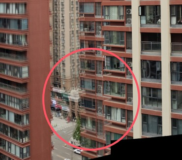
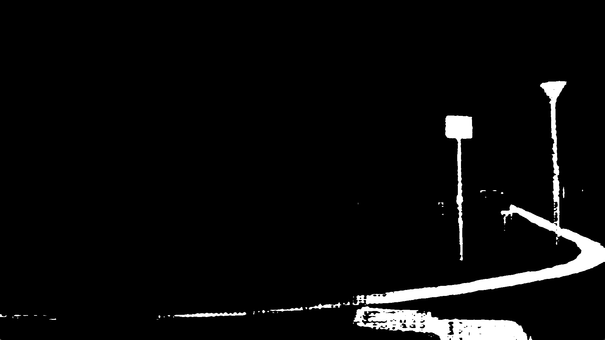
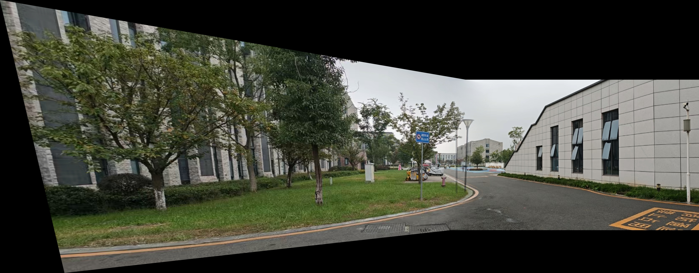
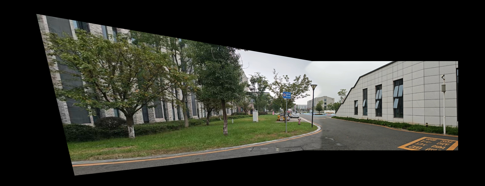

# multi-camera-image-stitching

Multi-camera image stitching with cylindrical projection, seam-aware blending
and grid-based illumination compensation.  
The pipeline is modular and **video-ready**: all components can be reused
for real-time multi-camera video stitching.

> 简介：多路摄像机全景图像拼接工程，包含柱面投影、接缝线优化、
> 简单羽化融合以及网格光照补偿模块，代码结构为后续升级到实时视频拼接预留了接口。

---

## Features

- **Multi-camera image stitching**
  - 支持多路图像输入与统一“世界画布（panorama canvas）”计算
- **Cylindrical projection (optional)**
  - 可选柱面投影（CP-SIFT 风格），适合较大视场角场景
- **Blending**
  - 简单羽化融合（feather blending）
  - 接缝线优化融合（seam-aware blending）
- **Illumination compensation**
  - 全局比例光照补偿
  - 基于网格 surface 的局部光照补偿
- **Modular design**
  - 几何、特征、光照、融合模块解耦，便于扩展到视频拼接管线

---

## Project structure

```text
.
├── main.py              # 主示例：多路图像 + 柱面投影 + 接缝融合 + 网格光照
├── test.py              # 调试脚本：几何 + 光照补偿对比
├── features/            # SIFT 特征、匹配、配置类型等
│   ├── detector.py
│   ├── matcher.py
│   └── types.py
├── geometry/            # 柱面投影、单应估计、世界画布、warp 等几何模块
│   ├── canvas.py
│   ├── cylindrical.py
│   ├── homography.py
│   └── warp.py
├── rendering/           # 简单融合、接缝融合、后处理
│   ├── illumination.py
│   ├── postprocess.py
│   └── seam_blending.py
├── views/               # 视图封装 / 相机视角相关类型
│   ├── init_views.py
│   └── types.py
├── image/               # 示例图片（city/weir 等测试数据）
└── requirements.txt     # 依赖列表
```
## Installation

Tested with Python 3.11 (conda environment "stitch").  
Python 3.10+ should work as well.

```bash
# 创建独立环境（示例）
conda create -n test python=3.11
conda activate test

# 安装依赖
pip install -r requirements.txt
```
## Quick start

### 1. 多路图像拼接（主流程）

```bash
python main.py ./image/city
```
**输入**：./image/city 目录下的多张图片
**输出**：results/ 目录：
`pano_feather.jpg` — 羽化融合结果
`pano_seam.jpg` — 接缝线优化融合结果

### 2.柱面投影
```bash
python main.py ./image/city --cyl
```
## Cylindrical vs planar projection

使用同一组 city 场景，对比平面投影与柱面投影下的接缝优化拼接结果：

<table>
  <tr>
    <th>平面投影（planar）</th>
    <th>柱面投影（cylindrical）</th>
  </tr>
  <tr>
    <td align="center">
      
    </td>
    <td align="center">
      
    </td>
  </tr>
</table>

## Seam-aware blending vs simple feathering

在主流程中，脚本会同时导出两张结果图：

`results/pano_feather.jpg` —— 简单融合（feather blending）
`results/pano_seam.jpg` —— 接缝优化融合（seam-aware blending）
<table>
  <tr>
    <th>简单融合（planar）</th>
    <th>接缝优化融合（cylindrical）</th>
  </tr>
  <tr>
    <td align="center">
      
    </td>
    <td align="center">
      
    </td>
  </tr>
</table>

在上面的对比图中，可以看到两种融合方式的差异：

- **简单融合（feather blending）**  
  - 只根据到重叠区两侧边界的距离做线性权重，越靠近哪一侧就越偏向哪张图。  
  - 优点：实现简单、速度快。  
  - 缺点：视差 / 几何误差明显时容易出现**双影、模糊**，明暗不一致时会出现**明显的亮度过渡带**。

- **接缝线优化融合（seam-aware blending）**  
  - 先在重叠区域计算能量（像素差、梯度等），再用动态规划寻找一条**代价最小的接缝线**，尽量让接缝经过背景和低纹理区域，避开建筑边缘、直线等高对比区域。  
  - 最终只在接缝附近做窄带融合，能明显减少**结构断裂、双影和亮度跳变**，接缝位置更不显眼。

> 简单理解：简单融合是“平均糊掉”，接缝优化融合是“先选对接缝在哪里再融”，在复杂场景下画质提升更明显。

### Seam mask input：避开关键目标的接缝通道

本工程的 seam 模块预留了 **接缝掩膜（seam mask）输入接口**，用于在拼接时显式避开关键目标。下面以一组 road 场景为例：

<table>
  <tr>
    <th>前景目标掩膜（来自 SAM）</th>
    <th>未避开目标的接缝融合</th>
    <th>避开目标后的接缝融合</th>
  </tr>
  <tr>
    <td align="center">
      
    </td>
    <td align="center">
      
    </td>
    <td align="center">
      
    </td>
  </tr>
</table>

- 左：使用 **SAM (Segment Anything Model)** 对路牌、路灯、车道线等前景目标生成的二值掩膜；
- 中：普通接缝优化，仅考虑像素差 / 梯度等能量，接缝可能穿过路牌附近，出现轻微结构割裂；
- 右：在能量图中对掩膜区域施加高惩罚，强制接缝绕开路牌和路灯，前景结构保持完整连贯。

在实现上，`seam_blending` 支持额外传入 `seam_mask` 通道，用于约束接缝的搜索空间。  
静态图像中，mask 由离线算法（如 SAM）生成即可；在视频场景下，可以在首帧生成并固化 mask 和接缝线，后续帧复用，同步兼顾画质和实时性。这里仅说明接口能力，不对具体分割模型做展开。

